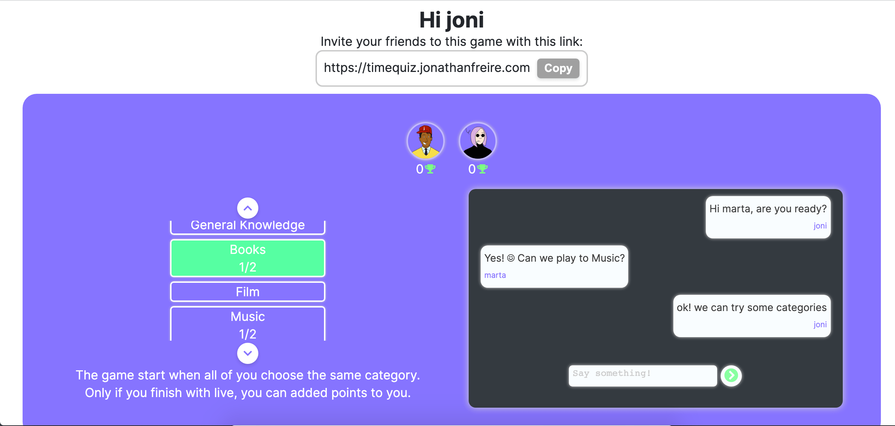

<h2 align="center">
  Time quiz - Jonathan Freire 
  <a href="https://timequiz.jonathanfreire.com/" target="_blank">timequiz.jonathanfreire.com</a>
</h2>

  

 

 &nbsp;
 &nbsp;
 &nbsp;

## TL;DR

You can fork this repo to modify and make changes of your own. I hope you enjoy it.

## Built With

Time quizz is a game of questions to play in real-time with connected people. So, invite your friends.

This project was built using these technologies.

- React.js
- Node.js
- Next.js
- Pusher.js
- uuid
- Sass
- VsCode
- Vercel

## Features

**🎨 Styled with SCSS**

**📱 Fully Responsive**

**Websockets with Pusher.js**

## Getting Started

Clone down this repository. You will need `node.js` and `git` installed globally on your machine.

## 🛠 Installation and Setup Instructions

1. Installation: `npm install`
2. You have to create a .env.development file in the parameters: `APP_ID_PUSHER`, `KEY_PUSHER`, `SECRET_PUSHER`, `CLUSTER_PUSHER` and `NEXT_PUBLIC_KEY_PUSHER`.
You will need to create an account in Pusher.
2. In the project directory, you can run: `npm start` or `npm run dev`

Runs the app in the development mode.\
Open [localhost:3000](localhost:3000) to view it in the browser.
The page will reload if you make edits.

## Usage Instructions

Open the project folder and Navigate to `/components/`.  
You will find all the components used and you can edit your information accordingly.

### Show your support

Give a ⭐ if you like this website!

## License

MIT

**Free Software, Yeah!**